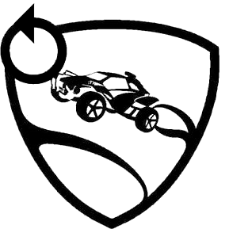

<html><head><meta content="text/html; charset=UTF-8" http-equiv="content-type"></head><body class="c59">

ROCKET LEAGUE

DATABASE&nbsp; &nbsp; on RLDB.me

A Software Engineering Project by

Supersonic Acrobatic Rocket-Powered Engineers

All Rocket League images, item names, descriptions, etc. are property and trademarks of Psyonix Inc.

Table of Contents

<a class="c8" href="#h.7shgumg6ag03">Motivation</a>&nbsp;&nbsp;&nbsp;&nbsp;&nbsp;&nbsp;&nbsp;&nbsp;<a class="c8" href="#h.7shgumg6ag03">5</a>

<a class="c8" href="#h.sht3ba3fw2za">Use Cases</a>&nbsp;&nbsp;&nbsp;&nbsp;&nbsp;&nbsp;&nbsp;&nbsp;<a class="c8" href="#h.sht3ba3fw2za">5</a>

<a class="c8" href="#h.49nb5wg67d5t">RESTfulAPI</a>&nbsp;&nbsp;&nbsp;&nbsp;&nbsp;&nbsp;&nbsp;&nbsp;<a class="c8" href="#h.49nb5wg67d5t">5</a>

<a class="c8" href="#h.6hug9ihfslt5">Models</a>&nbsp;&nbsp;&nbsp;&nbsp;&nbsp;&nbsp;&nbsp;&nbsp;<a class="c8" href="#h.6hug9ihfslt5">5</a>

<a class="c8" href="#h.ot865422g65i">Item</a>&nbsp;&nbsp;&nbsp;&nbsp;&nbsp;&nbsp;&nbsp;&nbsp;<a class="c8" href="#h.ot865422g65i">5</a>

<a class="c8" href="#h.z7b8o5ai0cx1">Attributes</a>&nbsp;&nbsp;&nbsp;&nbsp;&nbsp;&nbsp;&nbsp;&nbsp;<a class="c8" href="#h.z7b8o5ai0cx1">6</a>

<a class="c8" href="#h.ec6hebojlz6q">Crate</a>&nbsp;&nbsp;&nbsp;&nbsp;&nbsp;&nbsp;&nbsp;&nbsp;<a class="c8" href="#h.ec6hebojlz6q">6</a>

<a class="c8" href="#h.poj13ie2o94">Attributes</a>&nbsp;&nbsp;&nbsp;&nbsp;&nbsp;&nbsp;&nbsp;&nbsp;<a class="c8" href="#h.poj13ie2o94">6</a>

<a class="c8" href="#h.1rt61jvucob1">Body</a>&nbsp;&nbsp;&nbsp;&nbsp;&nbsp;&nbsp;&nbsp;&nbsp;<a class="c8" href="#h.1rt61jvucob1">6</a>

<a class="c8" href="#h.hj3h8js9lddb">Attributes</a>&nbsp;&nbsp;&nbsp;&nbsp;&nbsp;&nbsp;&nbsp;&nbsp;<a class="c8" href="#h.hj3h8js9lddb">6</a>

<a class="c8" href="#h.sg0rplufcr9x">Decal</a>&nbsp;&nbsp;&nbsp;&nbsp;&nbsp;&nbsp;&nbsp;&nbsp;<a class="c8" href="#h.sg0rplufcr9x">6</a>

<a class="c8" href="#h.qa5s7ojgxgpo">Attributes</a>&nbsp;&nbsp;&nbsp;&nbsp;&nbsp;&nbsp;&nbsp;&nbsp;<a class="c8" href="#h.qa5s7ojgxgpo">7</a>

<a class="c8" href="#h.e1ofz0h49x3h">Paint Finish</a>&nbsp;&nbsp;&nbsp;&nbsp;&nbsp;&nbsp;&nbsp;&nbsp;<a class="c8" href="#h.e1ofz0h49x3h">7</a>

<a class="c8" href="#h.pztixrub4qvw">Attributes</a>&nbsp;&nbsp;&nbsp;&nbsp;&nbsp;&nbsp;&nbsp;&nbsp;<a class="c8" href="#h.pztixrub4qvw">7</a>

<a class="c8" href="#h.dojkmy1muxp1">Player</a>&nbsp;&nbsp;&nbsp;&nbsp;&nbsp;&nbsp;&nbsp;&nbsp;<a class="c8" href="#h.dojkmy1muxp1">7</a>

<a class="c8" href="#h.2hf69pyjq1be">Attributes</a>&nbsp;&nbsp;&nbsp;&nbsp;&nbsp;&nbsp;&nbsp;&nbsp;<a class="c8" href="#h.2hf69pyjq1be">7</a>

<a class="c8" href="#h.29ry11m28h2z">Database</a>&nbsp;&nbsp;&nbsp;&nbsp;&nbsp;&nbsp;&nbsp;&nbsp;<a class="c8" href="#h.29ry11m28h2z">8</a>

<a class="c8" href="#h.gs1cbnjn0zw5">Tools</a>&nbsp;&nbsp;&nbsp;&nbsp;&nbsp;&nbsp;&nbsp;&nbsp;<a class="c8" href="#h.gs1cbnjn0zw5">8</a>

<a class="c8" href="#h.8vne8n2952s6">Application Tools</a>&nbsp;&nbsp;&nbsp;&nbsp;&nbsp;&nbsp;&nbsp;&nbsp;<a class="c8" href="#h.8vne8n2952s6">8</a>

<a class="c8" href="#h.xq19xtlncjbv">Git</a>&nbsp;&nbsp;&nbsp;&nbsp;&nbsp;&nbsp;&nbsp;&nbsp;<a class="c8" href="#h.xq19xtlncjbv">8</a>

<a class="c8" href="#h.n12xfim9ltjb">Introduction</a>&nbsp;&nbsp;&nbsp;&nbsp;&nbsp;&nbsp;&nbsp;&nbsp;<a class="c8" href="#h.n12xfim9ltjb">8</a>

<a class="c8" href="#h.zfs1s1kvpbrh">Workflow</a>&nbsp;&nbsp;&nbsp;&nbsp;&nbsp;&nbsp;&nbsp;&nbsp;<a class="c8" href="#h.zfs1s1kvpbrh">8</a>

<a class="c8" href="#h.aifnpd6exs1f">Workflow Details</a>&nbsp;&nbsp;&nbsp;&nbsp;&nbsp;&nbsp;&nbsp;&nbsp;<a class="c8" href="#h.aifnpd6exs1f">9</a>

<a class="c8" href="#h.pwvnefsivr9o">Feature Branches</a>&nbsp;&nbsp;&nbsp;&nbsp;&nbsp;&nbsp;&nbsp;&nbsp;<a class="c8" href="#h.pwvnefsivr9o">9</a>

<a class="c8" href="#h.rq4nir7pne14">Pull-Request Process</a>&nbsp;&nbsp;&nbsp;&nbsp;&nbsp;&nbsp;&nbsp;&nbsp;<a class="c8" href="#h.rq4nir7pne14">9</a>

<a class="c8" href="#h.5d3bl9fo9gfd">Creating a New Release</a>&nbsp;&nbsp;&nbsp;&nbsp;&nbsp;&nbsp;&nbsp;&nbsp;<a class="c8" href="#h.5d3bl9fo9gfd">9</a>

<a class="c8" href="#h.3hkre1ry0m22">Docker</a>&nbsp;&nbsp;&nbsp;&nbsp;&nbsp;&nbsp;&nbsp;&nbsp;<a class="c8" href="#h.3hkre1ry0m22">9</a>

<a class="c8" href="#h.5dphx9yainw9">Docker Implementation Details for Local Development</a>&nbsp;&nbsp;&nbsp;&nbsp;&nbsp;&nbsp;&nbsp;&nbsp;<a class="c8" href="#h.5dphx9yainw9">9</a>

<a class="c8" href="#h.rtgqdeurdgrv">Overview of the Containers</a>&nbsp;&nbsp;&nbsp;&nbsp;&nbsp;&nbsp;&nbsp;&nbsp;<a class="c8" href="#h.rtgqdeurdgrv">10</a>

<a class="c8" href="#h.hl36mu6sa1oz">Traefik</a>&nbsp;&nbsp;&nbsp;&nbsp;&nbsp;&nbsp;&nbsp;&nbsp;<a class="c8" href="#h.hl36mu6sa1oz">10</a>

<a class="c8" href="#h.anoyxliuiqo1">Db (rldb-db)</a>&nbsp;&nbsp;&nbsp;&nbsp;&nbsp;&nbsp;&nbsp;&nbsp;<a class="c8" href="#h.anoyxliuiqo1">10</a>

<a class="c8" href="#h.b9xjafm0pjet">Flask (rldb-flask)</a>&nbsp;&nbsp;&nbsp;&nbsp;&nbsp;&nbsp;&nbsp;&nbsp;<a class="c8" href="#h.b9xjafm0pjet">10</a>

<a class="c8" href="#h.lvakizgdqu4l">React (rldb-react)</a>&nbsp;&nbsp;&nbsp;&nbsp;&nbsp;&nbsp;&nbsp;&nbsp;<a class="c8" href="#h.lvakizgdqu4l">11</a>

<a class="c8" href="#h.ijnx0nv28zqk">Networking</a>&nbsp;&nbsp;&nbsp;&nbsp;&nbsp;&nbsp;&nbsp;&nbsp;<a class="c8" href="#h.ijnx0nv28zqk">11</a>

<a class="c8" href="#h.wtswtfsaiqh6">Docker Implementation Details for Dev</a>&nbsp;&nbsp;&nbsp;&nbsp;&nbsp;&nbsp;&nbsp;&nbsp;<a class="c8" href="#h.wtswtfsaiqh6">11</a>

<a class="c8" href="#h.4xndt3lcivkw">Overview of the Containers</a>&nbsp;&nbsp;&nbsp;&nbsp;&nbsp;&nbsp;&nbsp;&nbsp;<a class="c8" href="#h.4xndt3lcivkw">12</a>

<a class="c8" href="#h.e1a9tad49rh0">Traefik</a>&nbsp;&nbsp;&nbsp;&nbsp;&nbsp;&nbsp;&nbsp;&nbsp;<a class="c8" href="#h.e1a9tad49rh0">12</a>

<a class="c8" href="#h.1wovarrr9xnz">Db (rldb-db)</a>&nbsp;&nbsp;&nbsp;&nbsp;&nbsp;&nbsp;&nbsp;&nbsp;<a class="c8" href="#h.1wovarrr9xnz">12</a>

<a class="c8" href="#h.l0rp8twv1ws1">Flask (rldb-flask)</a>&nbsp;&nbsp;&nbsp;&nbsp;&nbsp;&nbsp;&nbsp;&nbsp;<a class="c8" href="#h.l0rp8twv1ws1">12</a>

<a class="c8" href="#h.qv2k7lsf9h7h">React (rldb-react)</a>&nbsp;&nbsp;&nbsp;&nbsp;&nbsp;&nbsp;&nbsp;&nbsp;<a class="c8" href="#h.qv2k7lsf9h7h">12</a>

<a class="c8" href="#h.sj5gnunou9w1">Watchtower (code_watchtower_1)</a>&nbsp;&nbsp;&nbsp;&nbsp;&nbsp;&nbsp;&nbsp;&nbsp;<a class="c8" href="#h.sj5gnunou9w1">12</a>

<a class="c8" href="#h.e3jeuewx1fdp">Networking</a>&nbsp;&nbsp;&nbsp;&nbsp;&nbsp;&nbsp;&nbsp;&nbsp;<a class="c8" href="#h.e3jeuewx1fdp">12</a>

<a class="c8" href="#h.8b986g8zebb2">Docker Implementation Details for Production</a>&nbsp;&nbsp;&nbsp;&nbsp;&nbsp;&nbsp;&nbsp;&nbsp;<a class="c8" href="#h.8b986g8zebb2">13</a>

<a class="c8" href="#h.xh2tc6ibhiw">Overview of the Containers</a>&nbsp;&nbsp;&nbsp;&nbsp;&nbsp;&nbsp;&nbsp;&nbsp;<a class="c8" href="#h.xh2tc6ibhiw">13</a>

<a class="c8" href="#h.qw0nwo5lz4ks">Traefik</a>&nbsp;&nbsp;&nbsp;&nbsp;&nbsp;&nbsp;&nbsp;&nbsp;<a class="c8" href="#h.qw0nwo5lz4ks">13</a>

<a class="c8" href="#h.yoyqu7cebi4a">Db (rldb-db)</a>&nbsp;&nbsp;&nbsp;&nbsp;&nbsp;&nbsp;&nbsp;&nbsp;<a class="c8" href="#h.yoyqu7cebi4a">13</a>

<a class="c8" href="#h.8pcm44kne18c">Flask (rldb-flask)</a>&nbsp;&nbsp;&nbsp;&nbsp;&nbsp;&nbsp;&nbsp;&nbsp;<a class="c8" href="#h.8pcm44kne18c">13</a>

<a class="c8" href="#h.qw8gia306glv">React (rldb-react)</a>&nbsp;&nbsp;&nbsp;&nbsp;&nbsp;&nbsp;&nbsp;&nbsp;<a class="c8" href="#h.qw8gia306glv">13</a>

<a class="c8" href="#h.5lsnqhx3agw9">Watchtower (code_watchtower_1)</a>&nbsp;&nbsp;&nbsp;&nbsp;&nbsp;&nbsp;&nbsp;&nbsp;<a class="c8" href="#h.5lsnqhx3agw9">13</a>

<a class="c8" href="#h.csdaz9hcl20">Networking</a>&nbsp;&nbsp;&nbsp;&nbsp;&nbsp;&nbsp;&nbsp;&nbsp;<a class="c8" href="#h.csdaz9hcl20">14</a>

<a class="c8" href="#h.50erwip576is">Flask</a>&nbsp;&nbsp;&nbsp;&nbsp;&nbsp;&nbsp;&nbsp;&nbsp;<a class="c8" href="#h.50erwip576is">14</a>

<a class="c8" href="#h.f21gama77sto">SQLAlchemy</a>&nbsp;&nbsp;&nbsp;&nbsp;&nbsp;&nbsp;&nbsp;&nbsp;<a class="c8" href="#h.f21gama77sto">14</a>

<a class="c8" href="#h.zgax4asq1twr">React</a>&nbsp;&nbsp;&nbsp;&nbsp;&nbsp;&nbsp;&nbsp;&nbsp;<a class="c8" href="#h.zgax4asq1twr">14</a>

<a class="c8" href="#h.ccxswcnlivn0">Traefik</a>&nbsp;&nbsp;&nbsp;&nbsp;&nbsp;&nbsp;&nbsp;&nbsp;<a class="c8" href="#h.ccxswcnlivn0">14</a>

<a class="c8" href="#h.vst3uxnma40">Definitions</a>&nbsp;&nbsp;&nbsp;&nbsp;&nbsp;&nbsp;&nbsp;&nbsp;<a class="c8" href="#h.vst3uxnma40">15</a>

<a class="c8" href="#h.gzjsb74lsq01">Apiary</a>&nbsp;&nbsp;&nbsp;&nbsp;&nbsp;&nbsp;&nbsp;&nbsp;<a class="c8" href="#h.gzjsb74lsq01">15</a>

<a class="c8" href="#h.6cw4b5kau5rw">Bootstrap</a>&nbsp;&nbsp;&nbsp;&nbsp;&nbsp;&nbsp;&nbsp;&nbsp;<a class="c8" href="#h.6cw4b5kau5rw">15</a>

<a class="c8" href="#h.wq7fnjuv3jd">Team Tools</a>&nbsp;&nbsp;&nbsp;&nbsp;&nbsp;&nbsp;&nbsp;&nbsp;<a class="c8" href="#h.wq7fnjuv3jd">16</a>

<a class="c8" href="#h.nw9svpc36s5j">Slack</a>&nbsp;&nbsp;&nbsp;&nbsp;&nbsp;&nbsp;&nbsp;&nbsp;<a class="c8" href="#h.nw9svpc36s5j">16</a>

<a class="c8" href="#h.ciy3i0t08jrd">Channels</a>&nbsp;&nbsp;&nbsp;&nbsp;&nbsp;&nbsp;&nbsp;&nbsp;<a class="c8" href="#h.ciy3i0t08jrd">17</a>

<a class="c8" href="#h.4d3ur752rndm">Trello</a>&nbsp;&nbsp;&nbsp;&nbsp;&nbsp;&nbsp;&nbsp;&nbsp;<a class="c8" href="#h.4d3ur752rndm">18</a>

<a class="c8" href="#h.eq8bcztod3k9">Labels</a>&nbsp;&nbsp;&nbsp;&nbsp;&nbsp;&nbsp;&nbsp;&nbsp;<a class="c8" href="#h.eq8bcztod3k9">18</a>

<a class="c8" href="#h.j46f7eac2kyo">Implementations</a>&nbsp;&nbsp;&nbsp;&nbsp;&nbsp;&nbsp;&nbsp;&nbsp;<a class="c8" href="#h.j46f7eac2kyo">18</a>

<a class="c8" href="#h.z0ockg7kuwot">Search</a>&nbsp;&nbsp;&nbsp;&nbsp;&nbsp;&nbsp;&nbsp;&nbsp;<a class="c8" href="#h.z0ockg7kuwot">18</a>

<a class="c8" href="#h.y1igrjg9ghn">Hosting</a>&nbsp;&nbsp;&nbsp;&nbsp;&nbsp;&nbsp;&nbsp;&nbsp;<a class="c8" href="#h.y1igrjg9ghn">19</a>

<a class="c8" href="#h.eyroxt10pd6p">Domain</a>&nbsp;&nbsp;&nbsp;&nbsp;&nbsp;&nbsp;&nbsp;&nbsp;<a class="c8" href="#h.eyroxt10pd6p">19</a>

<a class="c8" href="#h.zhuadi7g1bhq">GCP</a>&nbsp;&nbsp;&nbsp;&nbsp;&nbsp;&nbsp;&nbsp;&nbsp;<a class="c8" href="#h.zhuadi7g1bhq">19</a>

<a class="c8" href="#h.66wbdmxcvxnk">Old setup</a>&nbsp;&nbsp;&nbsp;&nbsp;&nbsp;&nbsp;&nbsp;&nbsp;<a class="c8" href="#h.66wbdmxcvxnk">19</a>

<a class="c8" href="#h.dd6khwq3v8d6">Cluster info</a>&nbsp;&nbsp;&nbsp;&nbsp;&nbsp;&nbsp;&nbsp;&nbsp;<a class="c8" href="#h.dd6khwq3v8d6">19</a>

<a class="c8" href="#h.gipzn47ybbpi">Workloads</a>&nbsp;&nbsp;&nbsp;&nbsp;&nbsp;&nbsp;&nbsp;&nbsp;<a class="c8" href="#h.gipzn47ybbpi">19</a>

<a class="c8" href="#h.icb6uhakmp5l">Load balancing</a>&nbsp;&nbsp;&nbsp;&nbsp;&nbsp;&nbsp;&nbsp;&nbsp;<a class="c8" href="#h.icb6uhakmp5l">19</a>

<a class="c8" href="#h.njcabr9ph5iz">Ingress</a>&nbsp;&nbsp;&nbsp;&nbsp;&nbsp;&nbsp;&nbsp;&nbsp;<a class="c8" href="#h.njcabr9ph5iz">19</a>

<a class="c8" href="#h.wt11gmnbumn3">New Setup</a>&nbsp;&nbsp;&nbsp;&nbsp;&nbsp;&nbsp;&nbsp;&nbsp;<a class="c8" href="#h.wt11gmnbumn3">20</a>

<a class="c8" href="#h.n72yu6shsb6j">Deployment</a>&nbsp;&nbsp;&nbsp;&nbsp;&nbsp;&nbsp;&nbsp;&nbsp;<a class="c8" href="#h.n72yu6shsb6j">20</a>

<a class="c8" href="#h.u8kic1bikitt">Travis-ci</a>&nbsp;&nbsp;&nbsp;&nbsp;&nbsp;&nbsp;&nbsp;&nbsp;<a class="c8" href="#h.u8kic1bikitt">20</a>

<a class="c8" href="#h.ekv9wfm7xlva">Github</a>&nbsp;&nbsp;&nbsp;&nbsp;&nbsp;&nbsp;&nbsp;&nbsp;<a class="c8" href="#h.ekv9wfm7xlva">20</a>

<a class="c8" href="#h.g14wb3mjsooi">Automatic Deployment</a>&nbsp;&nbsp;&nbsp;&nbsp;&nbsp;&nbsp;&nbsp;&nbsp;<a class="c8" href="#h.g14wb3mjsooi">20</a>

<a class="c8" href="#h.etevh3jqwrps">Dev</a>&nbsp;&nbsp;&nbsp;&nbsp;&nbsp;&nbsp;&nbsp;&nbsp;<a class="c8" href="#h.etevh3jqwrps">20</a>

<a class="c8" href="#h.4q0wvyc1jb3k">Production</a>&nbsp;&nbsp;&nbsp;&nbsp;&nbsp;&nbsp;&nbsp;&nbsp;<a class="c8" href="#h.4q0wvyc1jb3k">21</a>

<a class="c8" href="#h.hcf3wlumb69y">Manual (Old) Deployment</a>&nbsp;&nbsp;&nbsp;&nbsp;&nbsp;&nbsp;&nbsp;&nbsp;<a class="c8" href="#h.hcf3wlumb69y">21</a>

<h1 class="c9" id="h.7shgumg6ag03">Motivation</h1>
Rocket League is a soccer-based cross-platform video game where players control rocket-powered vehicles to hit a ball into the opposing team&rsquo;s goal. This video game allows cosmetic customization of each player&rsquo;s vehicles, introducing hundreds of items into the game. Rocket League Database, or RLDB, can provide information on all of these items, such as how to obtain these items and what items are exclusive to what vehicles or premium downloadable content (DLC).
<h1 class="c9" id="h.sht3ba3fw2za">Use Cases</h1>
Rocket League has thousands of players daily, with over 30,000 players on PC alone. There are some players only interested in free cosmetic items, while other players are interesting in paying for premium cosmetic items. We hope to cater to both types of players.

All cosmetic items will have a source attribute. This will be where users can find out if the item is a drop (free) or part of a crate or DLC (paid).

Players can also browse the Rocket League Leaderboards. The Player section of the application will provide player statistics. Users will be able to use that data to compare themselves to the player statistics of top players in Rocket League.
<h1 class="c9" id="h.49nb5wg67d5t">RESTfulAPI</h1>
The RESTful API is documented on Apiary.

Our current API design is focused around a set of GET requests that return JSON.
<h1 class="c9" id="h.6hug9ihfslt5">Models</h1><h3 class="c5" id="h.ot865422g65i">Item</h3>
Item is an object in which all in-game items extend from.

<h4 class="c44" id="h.z7b8o5ai0cx1">Attributes</h4>
Name&nbsp;&nbsp;&nbsp;&nbsp;&nbsp;&nbsp;&nbsp;&nbsp;&nbsp;&nbsp;&nbsp;&nbsp;&nbsp;&nbsp;&nbsp;&nbsp;A string of alphanumeric characters

Rarity&nbsp;&nbsp;&nbsp;&nbsp;&nbsp;&nbsp;&nbsp;&nbsp;&nbsp;&nbsp;&nbsp;&nbsp;&nbsp;&nbsp;&nbsp;&nbsp;One of nine (9) rarity types in the game

Source&nbsp;&nbsp;&nbsp;&nbsp;&nbsp;&nbsp;&nbsp;&nbsp;The source of the item. Can be Crate, Body, or drop.

<h3 class="c5" id="h.ec6hebojlz6q">Crate</h3>
Crates are items that are dropped after a match has conceded. Crates contain exclusive bodies, decals, and paint finishes (models described below). Crates can also contain more in-game items, including goal explosions, rocket boosts, wheels, and trails.

<h4 class="c44" id="h.poj13ie2o94">Attributes</h4>
Name

Rarity

Source

Release Date

Retire Date

Items

Number of Items

<h3 class="c5" id="h.1rt61jvucob1">Body</h3>
A body, or battle-car, is the player-controlled vehicle used to play the game. There are three ways to obtain bodies: 1) bodies come standard with the game; 2) bodies are obtained through the opening of crates; 3) bodies are obtained through purchasing DLC.

<h4 class="c44" id="h.hj3h8js9lddb">Attributes</h4>
Name

Rarity

Source

Release Date

Source

Decals

<h3 class="c5" id="h.sg0rplufcr9x">Decal</h3>
Bodies are customizable using decals. Most decals are exclusive to a body, with a few exceptions.

<h4 class="c44" id="h.qa5s7ojgxgpo">Attributes</h4>
Name

Rarity

Source

Is Animated

Is Paintable

Source

Bodies

<h3 class="c5" id="h.e1ofz0h49x3h">Paint Finish</h3>
Decals are customizable using paint finishes. Some decals, such as animated decals, disable the use of paint finishes.

<h4 class="c44" id="h.pztixrub4qvw">Attributes</h4>
Name

Rarity

Source

Release Date

Source

Decals

<h3 class="c5" id="h.dojkmy1muxp1">Player</h3>
Players have many stats tracked including ranking, skill rating, or win rate. Players can come from PC, Xbox, or PlayStation. In the future, players can even come from Nintendo Switch.

<h4 class="c44" id="h.2hf69pyjq1be">Attributes</h4>
Name

ID

Platform

Skill Rating

Wins

Signature Image

<h1 class="c9" id="h.29ry11m28h2z">Database</h1>
For local development, we are using the postgres:latest image as the database of choice. The container has a health-check that executes the pg_isready command against localhost with the default port. 

We use a bash script to update the database when we make changes on local development. This bash script runs a set of Python scripts that import data from our programmatic scrapers. The scrapers do not run automatically. 

We use other Python scripts to supplement our scraped data, such as a script that adds rows to a Rarity table, a table that contains every type of rarity in the game.

For production, we are running the database instance separately from the rest of the application deployment process, this way it is more stable and in case of errors, no data is lost. On the production server, we have a docker-compose file specifically for the database. In ~/db/docker-compose.yml, we defined the image we are using as well as the password and all the database name in environmental variables. These environmental variables end up being passed to the backend for it to use. The database docker-compose file also defines the networks in which our whole application is running against.
<h1 class="c9" id="h.gs1cbnjn0zw5">Tools</h1><h2 class="c20" id="h.8vne8n2952s6">Application Tools</h2><h3 class="c5" id="h.xq19xtlncjbv">Git</h3><h4 class="c44" id="h.n12xfim9ltjb">Introduction</h4>
Git is a version control system that we use to keep track of our changes as we progress in developing our application. The repository is located on Github: 

<a class="c8" href="https://www.google.com/url?q=https://github.com/janabimustafa/IDB&amp;sa=D&amp;ust=1511888561255000&amp;usg=AFQjCNHe6YBbfJVc-ev5go6Q2cWUMIcNXQ">https://github.com/janabimustafa/IDB</a>

<h4 class="c44" id="h.zfs1s1kvpbrh">Workflow</h4>
This project takes advantage of the Atlassian gitflow workflow. The project uses a central repository on a branch named master. All development is done on feature branches derived from the dev branch. When we are ready for a release, we merge all code from the dev branch to master, so that a new version of the application can be released.

<h4 class="c44" id="h.aifnpd6exs1f">Workflow Details</h4><h5 class="c31" id="h.pwvnefsivr9o">Feature Branches</h5>
Each new feature of the application will live in its own feature branch. We will. These feature branches will derive from the dev branch and will be merged back into dev through a pull-request once the work on the feature is complete. The feature branches should never interact with the master branch.
<h5 class="c31" id="h.rq4nir7pne14">Pull-Request Process</h5>
Once a feature is complete, a pull-request is created by the author of the feature. The author must include a good description of the changes in the overview of the pull-request, as well as at least one reviewer. The reviewer is chosen randomly (or depending on the current feature changeset). The pull-request will use dev as the base, and it will have to pass the Travis build and test process.
<h5 class="c31" id="h.5d3bl9fo9gfd">Creating a New Release</h5>
Once enough features have been merged into dev, we can start the release process by merging the dev branch into master. 

<h3 class="c5" id="h.3hkre1ry0m22">Docker</h3>
Docker is a software container platform that we use to manage our development environments. To run the application on your local machine, install Docker and Docker Compose. After the installation is complete, &nbsp;locate the repository on your local machine. Run these commands:

docker-compose build

docker-compose up -d

The application should be accessible on:

http://localhost

The API should be accessible on:

<a class="c8" href="https://www.google.com/url?q=http://localhost/api&amp;sa=D&amp;ust=1511888561258000&amp;usg=AFQjCNHbi7GBHWd1ywpxVgy6TOszpoIyrA">http://localhost/api</a>

<h4 class="c44" id="h.5dphx9yainw9">Docker Implementation Details for Local Development</h4>
This section will go into details on how the docker containers are setup and how the images are built for local development.
<h5 class="c31" id="h.rtgqdeurdgrv">Overview of the Containers</h5><h6 class="c31" id="h.hl36mu6sa1oz">Traefik</h6>
Depends on: react

Used as a reverse proxy for the other containers. This part is explained in details below.
<h6 class="c31" id="h.anoyxliuiqo1">Db (rldb-db)</h6>
For local development, we are using the postgres:latest image as the database of choice. The container has a health-check that executes the pg_isready command against localhost with the default port. 
<h6 class="c31" id="h.b9xjafm0pjet">Flask (rldb-flask)</h6>
Depends on: db

The flask container is responsible for our backend. It runs on and exposes port 5000. The server inside the container runs gunicorn with the --reload argument to make sure hot-reloading of code works while developing.

The container contains a health-check by creating a GET request to the /api endpoint. This way any container depending on this container will need to wait until that health-check succeeds. 

A volume mapping from the ./backend directory to the /app directory is created and is set as the working directory of the container.

The flask image is constructed by using the python:3.5-slim as the base image for the Dockerfile. The image build process is as follows:
<ol class="c22 lst-kix_bcsxxjbbqksf-0 start" start="1"><li class="c12 c14">Update the list of packages and install curl (required for the health-check of the container)</li><li class="c12 c14">Create a /config directory and copy the requirements.txt file to it. This is done separately from the rest of the code in order to utilize caching of the partial images when the image is built. That way the requirements are not installed again until the file changes.</li><li class="c12 c14">Execute pip to install the requirements in the requirements.txt file</li><li class="c12 c14">Finally, execute the flask-launcher.sh file which will launch Gunicorn.</li></ol>
The image is then tagged with the name gcr.io/rldb-idb/rldb-flask in order for GCP to accept our new image.
<h6 class="c31" id="h.lvakizgdqu4l">React (rldb-react)</h6>
Depends on: flask

The react container is responsible for our frontend. Currently, react is installed and ready to be used, but disabled due to Project #2&rsquo;s requirement of not needing react. The container uses and exposes port 3000. The container uses the npm start command with the CHOKIDAR_USEPOLLING=true flag, which allows for hot-loading of code during changes. The npm start&nbsp;command in turns uses the react-scripts start command. The container contains a health-check by creating a GET request.. This way any container depending on this container will need to wait until that health-check succeeds. 

A volume mapping from the ./frontend/rldb directory to the /app/rldb directory is created and is set as the working directory of the container.

The react image is constructed by using the node:latest as the base image for the Dockerfile. The image build process is as follows:
<ol class="c22 lst-kix_ypr1d07x6c1o-0 start" start="1"><li class="c12 c14">Set the working directory to /app</li><li class="c12 c14">Copy the rldb/package.json file to the working directory</li><li class="c12 c14">Set the npm log level to warn, that way the travis build is not cluttered with all the package installation info</li><li class="c12 c14">Add the /app/node_modiles/.bin to PATH </li><li class="c12 c14">Run the npm install command which will be cached by docker </li><li class="c12 c14">Run the npm start command</li></ol>
The image is then tagged with the name gcr.io/rldb-idb/rldb-react in order for GCP to accept our new image.

<h5 class="c31" id="h.ijnx0nv28zqk">Networking</h5>
All the containers run in a network called webgateway, which is bridged with the local machine. 

<h4 class="c44" id="h.wtswtfsaiqh6">Docker Implementation Details for Dev</h4>
This section will go into details on how the docker containers are setup and how the images are built for dev accessible from dev.rldb.me.
<h5 class="c31" id="h.4xndt3lcivkw">Overview of the Containers</h5><h6 class="c31" id="h.e1a9tad49rh0">Traefik</h6>
Depends on: react

Used as a reverse proxy for the other containers. This part is explained in details below.
<h6 class="c31" id="h.1wovarrr9xnz">Db (rldb-db)</h6>
For dev, we are using the postgres:latest image as the database of choice. The container has a health-check that executes the pg_isready command against localhost with the default port. In the Database section above, we explain in detail how this container is separated from the rest
<h6 class="c31" id="h.l0rp8twv1ws1">Flask (rldb-flask)</h6>
Depends on: db

The image build and run process is the same as for local development

The image is then tagged with the name janabimustafa/rldb-flask:dev in order for GCP to accept our new image.
<h6 class="c31" id="h.qv2k7lsf9h7h">React (rldb-react)</h6>
Depends on: flask

The image build and run process is the same as for local development

The image is then tagged with the name janabimustafa/rldb-react:dev in order for GCP to accept our new image.

<h6 class="c31" id="h.sj5gnunou9w1">Watchtower (code_watchtower_1)</h6>
We are using <a class="c8" href="https://www.google.com/url?q=https://github.com/v2tec/watchtower&amp;sa=D&amp;ust=1511888561264000&amp;usg=AFQjCNG_H59Koh_KADVri9oK4E53jCoIwA">watchtower </a>to monitor and pull the latest image changes automatically. It monitors janabimustafa/rldb-flask:dev and janabimustafa/rldb-react:dev. When watchtower notices a change in the upstream, it will pull the latest docker images built by Travis and deploys them to the server. This is all done automatically to ensure what&rsquo;s on the dev branch is being reflected on dev.rldb.me
<h5 class="c31" id="h.e3jeuewx1fdp">Networking</h5>
All the containers run in a network called webgateway, which is bridged with the local machine and created separately with the database.

<h4 class="c44" id="h.8b986g8zebb2">Docker Implementation Details for Production</h4>
This section will go into details on how the docker containers are setup and how the images are built for production.
<h5 class="c31" id="h.xh2tc6ibhiw">Overview of the Containers</h5><h6 class="c31" id="h.qw0nwo5lz4ks">Traefik</h6>
Depends on: react

Used as a reverse proxy for the other containers. This part is explained in details below.
<h6 class="c31" id="h.yoyqu7cebi4a">Db (rldb-db)</h6>
For prod, we are using the postgres:latest image as the database of choice. The container has a health-check that executes the pg_isready command against localhost with the default port. In the Database section above, we explain in detail how this container is separated from the rest
<h6 class="c31" id="h.8pcm44kne18c">Flask (rldb-flask)</h6>
Depends on: db

The image build and run process is the same as for local development

The image is then tagged with the name janabimustafa/rldb-flask in order for GCP to accept our new image.
<h6 class="c31" id="h.qw8gia306glv">React (rldb-react)</h6>
Depends on: flask

The image build and run process is the same as for local development

The image is then tagged with the name janabimustafa/rldb-react in order for GCP to accept our new image.

<h6 class="c31" id="h.5lsnqhx3agw9">Watchtower (code_watchtower_1)</h6>
We are using <a class="c8" href="https://www.google.com/url?q=https://github.com/v2tec/watchtower&amp;sa=D&amp;ust=1511888561268000&amp;usg=AFQjCNGdD3LJ6DDxVniuo_JCL9xEC8MTXg">watchtower </a>to monitor and pull the latest image changes automatically. It monitors janabimustafa/rldb-flask and janabimustafa/rldb-react. When watchtower notices a change in the upstream, it will pull the latest docker images built by Travis and deploys them to the server. This is all done automatically to ensure what&rsquo;s on the master branch is being reflected on rldb.me
<h5 class="c31" id="h.csdaz9hcl20">Networking</h5>
All the containers run in a network called webgateway, which is bridged with the local machine and created separately with the database.

&nbsp;&nbsp;&nbsp;&nbsp;&nbsp;&nbsp;&nbsp;&nbsp;&nbsp;&nbsp;&nbsp;&nbsp;&nbsp;&nbsp;&nbsp;&nbsp;
<h3 class="c5" id="h.50erwip576is">Flask</h3>
Flask is a web framework written in Python. An add-on to Flask is Flask-RESTPlus, which makes writing RESTful APIs with Flask much easier. Flask allows developers to very simply assign endpoints (like &ldquo;/api&rdquo;) to functions and pass some parameters from the request. Flask-RESTPlus makes this all the more easier by defining endpoints as analogous to resources, which can have multiple functions (GET, POST, etc), and adding many methods to parse and return machine readable formats (like JSON).

&nbsp;&nbsp;&nbsp;&nbsp;&nbsp;&nbsp;&nbsp;&nbsp;
<h3 class="c5" id="h.f21gama77sto">SQLAlchemy</h3>
SQLAlchemy is a python library and ORM for interacting with SQL-like databases. SQLAlchemy lets developers define a system of classes which are then reflected into a schema for the database. Instead of directly issuing SQL queries, SQLAlchemy allows developers to call functions and methods just like &ldquo;normal&rdquo; Python objects. SQLAlchemy-Searchable is an extension to this library to easily allow searching of full text fields. We use this and a custom search function to return results based on keywords.

<h3 class="c5" id="h.zgax4asq1twr">React</h3>
React is a JavaScript library for building user interfaces. We use React to relay information between our API and our site.

<h3 class="c5" id="h.ccxswcnlivn0">Traefik</h3>
Traefik is a modern reverse proxy and load balancer, similar to more well known tools like NGINX. We use Traefik to manage a reverse proxy inside Docker. Put simply, the Traefik server runs on the public facing HTTP port and directs incoming requests to specified internal services, running on their own ports. In our project, we utilize both React and Flask, each with their own port, and route traffic based on the incoming request URI. If the &nbsp;inbound request is for /api/&hellip; then it goes to Flask, otherwise to React.

<h4 class="c44" id="h.vst3uxnma40">Definitions</h4>
[backends]

&nbsp;[backends.flask]

&nbsp; &nbsp;[backends.flask.servers.server1]

&nbsp; &nbsp;url =&nbsp;&quot;http://flask:5000&quot;

&nbsp; &nbsp;weight =&nbsp;10

&nbsp;[backends.react]

&nbsp; &nbsp;[backends.react.servers.server1]

&nbsp; &nbsp;url =&nbsp;&quot;http://react:3000&quot;

&nbsp; &nbsp;weight =&nbsp;10

[frontends]

&nbsp;[frontends.swagger]

&nbsp;passHostHeader =&nbsp;true

&nbsp;backend =&nbsp;&quot;flask&quot;

&nbsp; &nbsp;[frontends.swagger.routes.swaggerui]

&nbsp; &nbsp;rule =&nbsp;&quot;PathPrefix:/swaggerui&quot;

&nbsp;[frontends.flask]

&nbsp;passHostHeader =&nbsp;true

&nbsp;backend =&nbsp;&quot;flask&quot;

&nbsp; &nbsp;[frontends.flask.routes.api]

&nbsp; &nbsp;rule =&nbsp;&quot;PathPrefix:/api&quot;

&nbsp;[frontends.react]

&nbsp;passHostHeader =&nbsp;true

&nbsp;backend =&nbsp;&quot;react&quot;&nbsp; &nbsp;

<h3 class="c5" id="h.gzjsb74lsq01">Apiary</h3>
Apiary is a platform that facilitates API design, development, and documentation. For our purposes, it lets us easily document each of the endpoints of our Flask API. Additionally, Apiary can sync with the GitHub repo, so that we can maintain an &ldquo;Apiary Settings File&rdquo; within the repo itself and any changes pushed into the master branch immediately become live in the Apiary documentation. Finally, Apiary has functionality to allow testing of each documented endpoint; i.e. readers can create a &ldquo;fake&rdquo; request and get back an example response; this can come either from a static data set or a real server.

<h3 class="c5" id="h.6cw4b5kau5rw">Bootstrap</h3>
Bootstrap is a framework for developing UI&rsquo;s for web applications and sites. Bootstrap is responsive, meaning it will automatically scale page elements for varying screen sizes. 

To set up Bootstrap, we use a CDN, or Content Delivery Network. Instead of keeping the CSS and HTML source code and Javascript extensions of Bootstrap on our server, we use a network link. This is as simple as adding links to the CDN in the header of our HTML source code. We are using version 3.3.7 of Bootstrap via BootstrapCDN, a free and public CDN on MaxCDN. When people visit our website, their browser will download Bootstrap from the CDN, instead of from us. Because Bootstrap is a commonly used framework, one advantage of this is that the files are often cached, leading to a faster loading time for our webpage.

Pages using Bootstrap are structured with a flexbox grid system that allows heavy customization, leading to a large range of control while still maintaining responsiveness. One of Bootstrap&rsquo;s design principles is mobile-first, expressing that it&rsquo;s often easier to convert a mobile page to a desktop page, but not the other way. 

As for the basics on Bootstrap&rsquo;s grid system, there are containers, rows, and columns. All of a site&rsquo;s content should be in a container. Each container has any number of rows. Each row has room for 12 columns, meaning you can have 12 columns of width 1 or 3 columns of width 4. By placing content in these columns, Bootstrap can then adjust the size and position of the columns to fit varying screen dimensions. 

When you visit our site, you are directed our landing page which currently only has a sliding carousel of Rocket League images. To progress to other pages, we have a fixed navbar at the top of the page with links to each of our models, as well as our about page. Clicking on any of these will move you to another page of our site. Model pages contain a list of all instances of the model currently on the site, which link to individual item pages on click. 

<h2 class="c20" id="h.wq7fnjuv3jd">Team Tools</h2><h3 class="c5" id="h.nw9svpc36s5j">Slack</h3>
Our team utilizes Slack Messaging for all our communication needs. This fantastic chat application offers a single location to manage team-wide, as well as individual communication. Slack offers the ability to create multiple chat channels within a single chat room, each with arbitrary members, allowing us to easily break off into sub-teams to discuss tasks under the purview of only a few members, leaving the general channel free of unnecessary clutter. 

The utilities of Slack do not end there. Slack comes pre-loaded with a veritable cornucopia of emojis, which can be added to one&rsquo;s message, or left as reactions to another, allowing developers to build a greater rapport and collaborate more than would be capable using a plaintext chat platform.

In addition to the communication organization capabilities, Slack provides excellent integration with other ubiquitous software engineering tools, such as GitHub and Trello. From minute one we can add pre-made &lsquo;bots&rsquo; to our channel, that are linked with our accounts on the external sites mentioned, which will post messages in designated channels notifying the team of activity or changes in real time.

<h4 class="c44" id="h.ciy3i0t08jrd">Channels</h4>
Our team uses a number of channels in order to filter project topics.

#general

The General channel is used for team-wide communication. Topics include project detail discussion, complaints and grievances, and pinging members for responses.

#github

The Github channel uses Github integration to report on repository activities. The Github channel is where members receive notifications for commits, pull requests, comments, and merges into the repository and branches.

#user-stories

The User-stories channel is used for discussion of user stories. After planning user stories on PlanIt Poker, we use this channel to discuss assumptions, concerns, and assignment of issues.

#trello_channel

The Trello_channel channel is an isolated channel for the Trello bot. Instead of adding the Trello bot to every channel, we just have the Trello bot roam its own channel.

#uptime

The Uptime channel is an isolated channel for the uptime bot. The uptime bot lets us know when our site goes down, attaching a reason in the message. Once our site goes back up, the uptime bot lets us know the time lapsed from when the site had gone down to when it goes back up.

#random

The Random channel was created by our comedic relief for comedic relief.
<h3 class="c5" id="h.4d3ur752rndm">Trello</h3>
Trello is a web-based project management platform that tracks issues using &ldquo;cards&rdquo; on a &ldquo;board&rdquo;. Rather than constantly communicating individually on what tasks are currently being worked on and what needs to be done, Trello allows us to quickly understand our workflow and heavily expedites the development process. Trello allows users to add members, labels, checklists, a due date, attachments, descriptions, and comments to the cards. 

<h4 class="c44" id="h.eq8bcztod3k9">Labels</h4>
We are currently using six (6) labels.

Technical Report

Issues involving the technical report.

Project Detail

Issues involving the project rubric that do not require development.

React

Issues involving the React framework. Likely combined with GUI label.

Back-end

Issues involving the database, Flask, or the API.

GUI

Issues involving the user interface of the site.

Ops

Issues involving the technical operations of the application such as Google Cloud Platform and the DNS.
<h1 class="c9" id="h.j46f7eac2kyo">Implementations</h1><h2 class="c20" id="h.z0ockg7kuwot">&nbsp;&nbsp;&nbsp;&nbsp;&nbsp;&nbsp;&nbsp;&nbsp;Search</h2>
Searching is accomplished by checking each attribute of each instance for a value containing a given search term. The occurrences are counted and used to determine how relevant that instance &nbsp;is. After processing every instance, objects with at least 1 match are returned in descending order of relevancy. From the UI side, these results are then parsed and displayed with the search term bolded.
<h1 class="c9" id="h.y1igrjg9ghn">Hosting</h1><h2 class="c20" id="h.eyroxt10pd6p">Domain</h2>
The domain is registered on namecheap.com under the rldb.me domain.

The Nameserver is set to namecheap&rsquo;s with the following records:

<table class="c49"><tbody><tr class="c35"><td class="c24" colspan="1" rowspan="1">
Record type
</td><td class="c24" colspan="1" rowspan="1">
Host
</td><td class="c24" colspan="1" rowspan="1">
Destination
</td></tr><tr class="c35"><td class="c24" colspan="1" rowspan="1">
A Record
</td><td class="c24" colspan="1" rowspan="1">
@
</td><td class="c24" colspan="1" rowspan="1">
104.198.24.59
</td></tr><tr class="c35"><td class="c24" colspan="1" rowspan="1">
A Record
</td><td class="c24" colspan="1" rowspan="1">
www
</td><td class="c24" colspan="1" rowspan="1">
104.198.24.59
</td></tr><tr class="c35"><td class="c24" colspan="1" rowspan="1">
A Record
</td><td class="c24" colspan="1" rowspan="1">
dev
</td><td class="c24" colspan="1" rowspan="1">
35.188.192.236
</td></tr></tbody></table>

<h2 class="c20" id="h.zhuadi7g1bhq">GCP</h2><h3 class="c20" id="h.66wbdmxcvxnk">Old setup</h3>
For this project, we are using Google&rsquo;s Container Engine to host our application. We are no longer using this approach because of expenses.&nbsp;
<h4 class="c19" id="h.dd6khwq3v8d6">Cluster info</h4>
We are utilizing a container cluster in the us-central1-a zone with a size of 1 node. The cluster is running node version 1.7.5 and has 1 core from a vCPU (some Xeon processor) and total memory of 1.7GB. 

<h4 class="c19" id="h.gipzn47ybbpi">Workloads</h4>
The cluster is currently hosting two workloads: rldb-flask, and rldb-react. 

<h4 class="c19" id="h.icb6uhakmp5l">Load balancing</h4>
Each one of the workloads is exposed internally through a Node Port service. They are assigned a random port and ip that only other services within the network (such as our ingress) can see.

&nbsp;
<h4 class="c19" id="h.njcabr9ph5iz">Ingress</h4>
We are utilizing Kubernetes&rsquo; basic ingress to provide routing. We&rsquo;ve setup multiple endpoint rules such as */ forwarding to the react service backend and */api/* forwarding to the flask service backend. This is currently a work in progress as the flask endpoint is not behaving correctly. We are using the ip address of this ingress for the publicly facing site. There are health checks in place within the ingress to make sure the services are healthy and to scale otherwise. 
<h3 class="c20" id="h.wt11gmnbumn3">New Setup</h3>
For this project, we are using Google&rsquo;s Compute Engine with 2 VM&rsquo;s running on the microCPU tier. Each vm has 0.6GB of memory and 10GB of storage space. Basically the cheapest option Google offers.

<h2 class="c20" id="h.n72yu6shsb6j">Deployment</h2><h3 class="c5" id="h.u8kic1bikitt">Travis-ci</h3>
Travis is our deployment and build continuous integration system. It is currently setup to test the branches and if it detects changes to dev or master branches with all the tests passing, it will start the deployment process.
<h3 class="c5" id="h.ekv9wfm7xlva">Github</h3>
Github is currently setup with a webhook against travis, so all commits and branches are built automatically
<h3 class="c5" id="h.g14wb3mjsooi">Automatic Deployment</h3><h4 class="c19" id="h.etevh3jqwrps">Dev</h4>
When Travis detects it is executing a build against the dev git branch, it will execute the following:
<ol class="c22 lst-kix_3w1aic2gg9c-0 start" start="1"><li class="c1 c17">Login to hub.docker.com in order to gain push access</li><li class="c1 c17">Tag the images of rldb-flask and rldb-react to rldb-flask:dev and rldb-react:dev</li><li class="c1 c17">Push the build image to docker hub on <a class="c8" href="https://www.google.com/url?q=https://hub.docker.com/r/janabimustafa/rldb-flask/&amp;sa=D&amp;ust=1511888561286000&amp;usg=AFQjCNEaL1cw551fBREJ4KBiQeoKQlnx7w">https://hub.docker.com/r/janabimustafa/rldb-flask/</a>&nbsp;and https://hub.docker.com/r/janabimustafa/rldb-react/</li></ol>
After the push is complete, <a class="c8" href="#h.sj5gnunou9w1">watchtower</a>&nbsp;will notice the new image, and will attempt to:
<ol class="c22 lst-kix_l25hg0e4kn01-0 start" start="1"><li class="c1 c17">Pull the new image</li><li class="c1 c17">Stop the running containers</li><li class="c1 c17">Remove the old containers</li><li class="c1 c17">Start the new containers from the new image</li><li class="c1 c17">Remove the old orphan images to save disk space</li></ol>
This process ensures that what&rsquo;s on the dev branch is automatically deployed to dev.rldb.me

<h4 class="c19" id="h.4q0wvyc1jb3k">Production</h4>
When Travis detects it is executing a build against the master git branch, it will execute the following:
<ol class="c22 lst-kix_msnpjrueuzfs-0 start" start="1"><li class="c1 c17">Login to hub.docker.com in order to gain push access</li><li class="c1 c17">Push the build image to docker hub on <a class="c8" href="https://www.google.com/url?q=https://hub.docker.com/r/janabimustafa/rldb-flask/&amp;sa=D&amp;ust=1511888561287000&amp;usg=AFQjCNF2TIU7De3a6JO-jzRgIiZ57E-AXw">https://hub.docker.com/r/janabimustafa/rldb-flask/</a>&nbsp;and https://hub.docker.com/r/janabimustafa/rldb-react/</li></ol>
After the push is complete, <a class="c8" href="#h.sj5gnunou9w1">watchtower</a>&nbsp;will notice the new image, and will attempt to:
<ol class="c22 lst-kix_3btyzsek2nq5-0 start" start="1"><li class="c1 c17">Pull the new image</li><li class="c1 c17">Stop the running containers</li><li class="c1 c17">Remove the old containers</li><li class="c1 c17">Start the new containers from the new image</li><li class="c1 c17">Remove the old orphan images to save disk space</li></ol>
This process ensures that what&rsquo;s on the master branch is automatically deployed to rldb.me
<h3 class="c5" id="h.hcf3wlumb69y">Manual (Old) Deployment</h3>
Using the gcloud SDK and kubernetes, we can deploy our docker images directly to Google Container Engine. The process is as follows:
<ol class="c22 lst-kix_2d58pa59ebwj-0 start" start="1"><li class="c1 c17">The image is built using docker-compose</li></ol>
&nbsp;&nbsp;&nbsp;&nbsp;&nbsp;&nbsp;&nbsp;&nbsp;docker-compose build
<ol class="c22 lst-kix_2d58pa59ebwj-0" start="2"><li class="c1 c17">The image is tagged with the commit id or the version number (for production)</li><li class="c1 c17">The images are pushed to google&rsquo;s internal image directory</li></ol>
&nbsp;&nbsp;&nbsp;&nbsp;&nbsp;&nbsp;&nbsp;&nbsp;gcloud docker -- push image-name:tag
<ol class="c22 lst-kix_2d58pa59ebwj-0" start="4"><li class="c1 c17">The deployment image is set using the pushed image&rsquo;s tag. </li></ol>
&nbsp;&nbsp;&nbsp;&nbsp;&nbsp;&nbsp;&nbsp;&nbsp;As an example, here is how the react deployment is sent: 

kubectl set image deployment/rldb-react rldb-react=gcr.io/rldb-idb/rldb-react:latest

This deployment process will be automated, and most of the work for this is already done with Travis. There is currently a permission issue with google cloud that we are trying to figure out still.

<h2 class="c20 c61" id="h.h343f2557nyg"></h2></body></html>